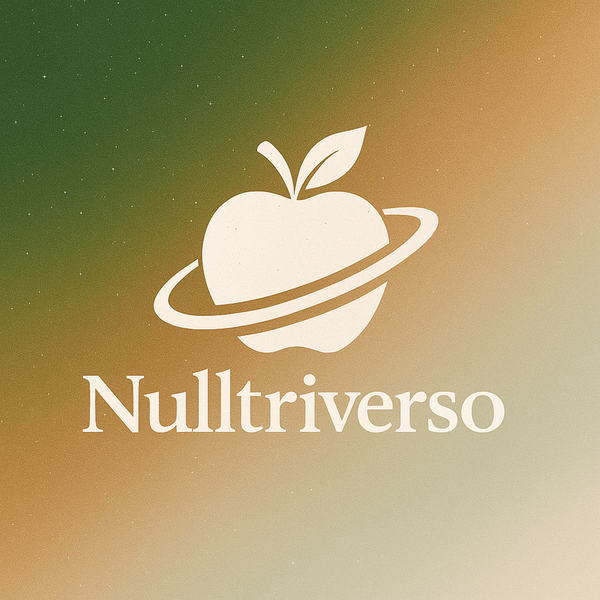
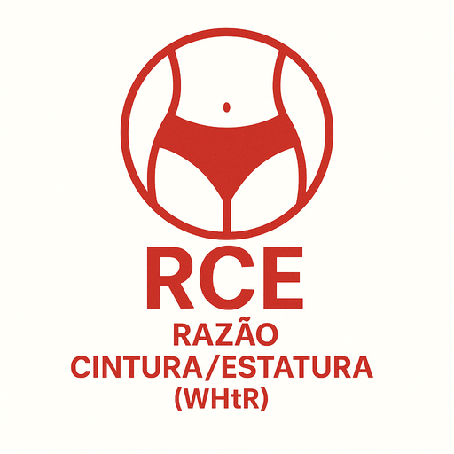
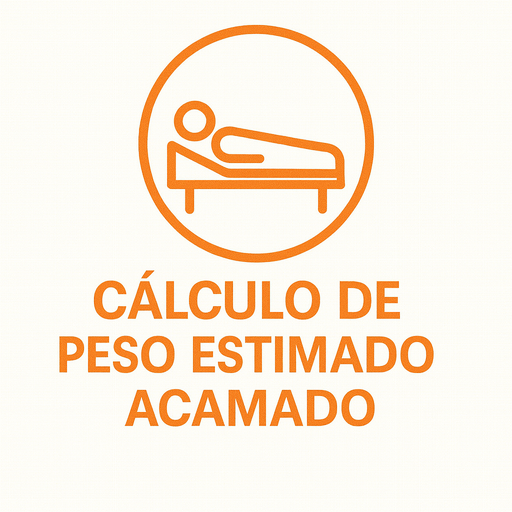
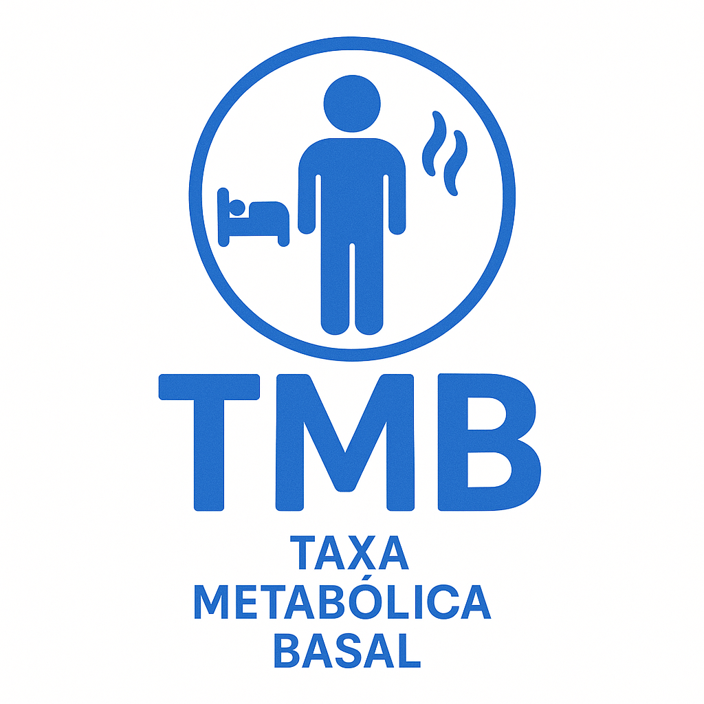
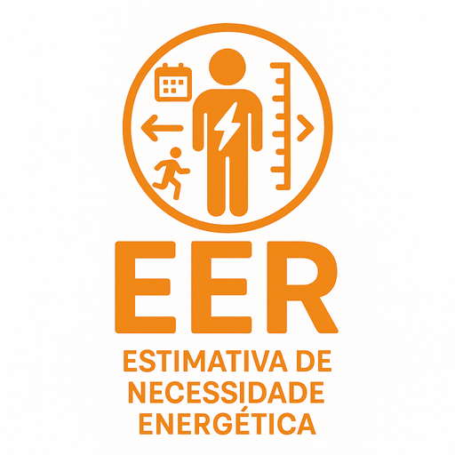
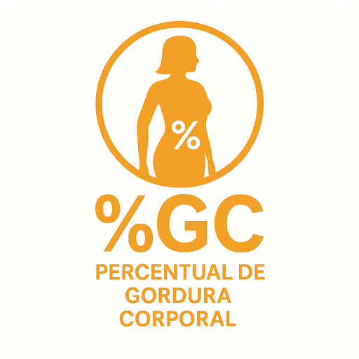
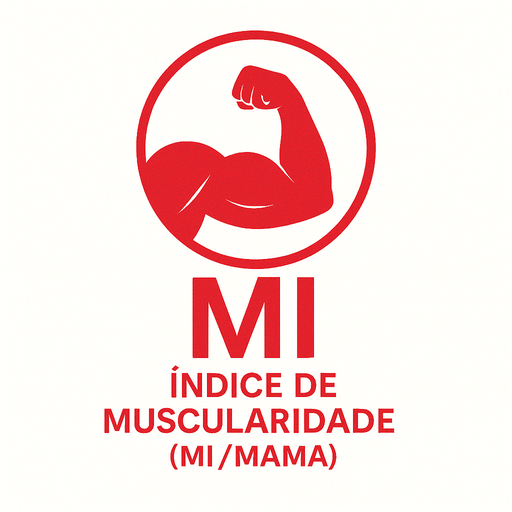

# Projeto de Interface

## Visao geral

O app abre em uma **tela de boas-vindas/login** com gradiente roxo/ambar, animacao de "buraco negro" (discos giratorios), campo de estrelas e CTA "Seja bem-vindo!" que libera o menu (sem autenticacao real). O formulario traz campos de email/senha ficticios, toggle de visibilidade e links para **Criar conta** e **Esqueci minha senha**. O cadastro usa sessoes (identidade, contato, seguranca) com formatacao de data/CPF/telefone; a recuperacao de senha traz validacao de email/CPF, campos OTP ficticios e troca de senha ilustrativa. A tela de **Perfil** exibe cartao flip com dados mock e formulario de senha. Em seguida, surge um **menu em grade** com 3 colunas, gradiente de fundo e campo de estrelas. Cada card tem ilustracao autoral e leva a uma calculadora. As calculadoras compartilham o mesmo esqueleto: header com kicker/titulo/subtitulo, botao de voltar para o menu, `SectionCard` para formulario/resultado, `PrimaryButton` para acao e `ResultRow` para resumo. Layout unico com `KeyboardAvoidingView` para manter inputs visiveis.

## Identidade visual

- **Paleta**: verdes e tons terrosos nas calculadoras (primario `#0f482f`, sucesso `#22c55e`, alerta `#f59e0b`, critico `#ef4444`, fundos `#f7f4ef`/`#ebe2d9`) e gradientes roxo/ambar na tela de login/menu (`loginGradient` e `menuGradient`).
- **Tipografia**: fontes do sistema com pesos fortes em titulos e contraste moderado no corpo.
- **Iconografia**: 12 logos autorais nos cards do menu (PNG otimizados a 512 px); gauge semicircular + barra de progresso na tela de IMC; logo central em orbita na tela inicial (~600 px).

## Componentes-chave

- **SectionCard**: container com borda suave para formularios, resultados e dicas.
- **TextField**: input com borda clara, teclado decimal, aceita virgula/ponto e pode exibir icones.
- **PrimaryButton**: botao verde em largura total do card.
- **Pills/tiles**: seletores de sexo, fator de atividade, protocolo, metodo ou unidade (mudam borda/fundo quando ativos); menu bar fixa no rodape do menu com Perfil/Menu/Sair.
- **ResultRow**: linha chave/valor para organizar o resumo.
- **ImcGauge**: componente SVG plugavel usado no IMC (sem grafico de linha real).
- **BackToMenuButton**: atalho presente nas calculadoras para retornar ao menu.
- **InlineMenuBar**: barra compacta no Perfil; `StarField` em Login/Menu/Perfil reforca a identidade "Nulltriverso".
- **Vortex login**: combinacao de `Animated` + `LinearGradient` para discos giratorios na tela inicial.

## Fluxos por tela e formulas resumidas

- **Login/boas-vindas**: animacao + dois campos (email e senha ficticios) e CTA "Seja bem-vindo!" que abre o menu sem validar credenciais; links levam a cadastro e reset (sem backend).
- **Cadastro**: sessoes Identidade/Contato/Seguranca com formatacao de CPF/data/telefone, selecao de sexo/tipo e aceite de termos; envia para o menu ao concluir.
- **Recuperacao de senha**: email + CPF + OTP mock + definicao de nova senha em um unico fluxo ilustrativo.
- **Perfil**: cartao flip com dados mock e formulario de alteracao de senha (alerta de sucesso local).
- **IMC**: peso/altura -> IMC = peso / (altura em m)^2 -> faixa OMS, gauge e barra de progresso.
- **RCEst / WHtR**: cintura/altura em cm -> razao -> faixas de risco (<0,4 muito baixo, 0,4-0,5 saudavel, 0,5-0,6 aumentado, >0,6 muito alto).
- **RCQ**: cintura/quadril em cm -> razao -> faixas por sexo (OMS/WHO).
- **Peso acamado**: Chumlea por sexo usando CPA, altura do joelho, CB e dobra subescapular (mm).
- **TMB**: Harris-Benedict revisado com sexo, idade, peso, altura.
- **EER**: IOM adulto com fator de atividade por sexo + bonus gestacional (8 kcal/sem + 180).
- **GET**: GEB (Harris-Benedict) multiplicado pelo NAF escolhido.
- **NAF**: escala OMS (1,0-1,39 ate 1,9-2,5) com opcao de informar TMB para ver GET minimo/maximo.
- **% Gordura corporal**: Jackson & Pollock 3/7 dobras + Siri ou circunferencias US Navy (pescoco/cintura/quadril/altura).
- **Massa muscular do braco (MAMA)**: CMB = CB - pi*PCT, area = (CMB^2)/(4*pi), aceita PCT em mm ou cm.
- **Macros**: kcal diario + % de carbo/proteina/gordura (faixas 45-60 / 15-25 / 20-35) -> gramas/dia (4/4/9 kcal/g).
- **Hidrica**: 30-35 ml/kg, 1 ml/kcal ou Holliday-Segar (100/50/20 ml/kg).

## Imagens por tela (otimizadas)

  

<table> <tr> <td align="center"> IMC</td> <td align="center"> RCEst / WHtR</td> <td align="center"> RCQ</td> </tr> <tr> <td align="center"> Peso acamado</td> <td align="center"> TMB</td> <td align="center"> EER</td> </tr> <tr> <td align="center"> GET</td> <td align="center"> NAF</td> <td align="center"> % Gordura</td> </tr> <tr> <td align="center"> Massa muscular</td> <td align="center"> Macros</td> <td align="center"> Hidrica</td> </tr> </table>

## Acessibilidade e UX

- Teclados decimais e `KeyboardAvoidingView` em todas as telas.
- Mensagens curtas ("Peso invalido.", "As porcentagens devem somar 100%.").
- Cores sempre acompanhadas de texto para nao depender apenas de cor.
- Padding lateral de 24 px, espacamento consistente entre elementos e cards largos para leitura.
- Animacao suave de entrada nos cards do menu, feedback de press (spring) e tela de login que nao bloqueia o uso.

