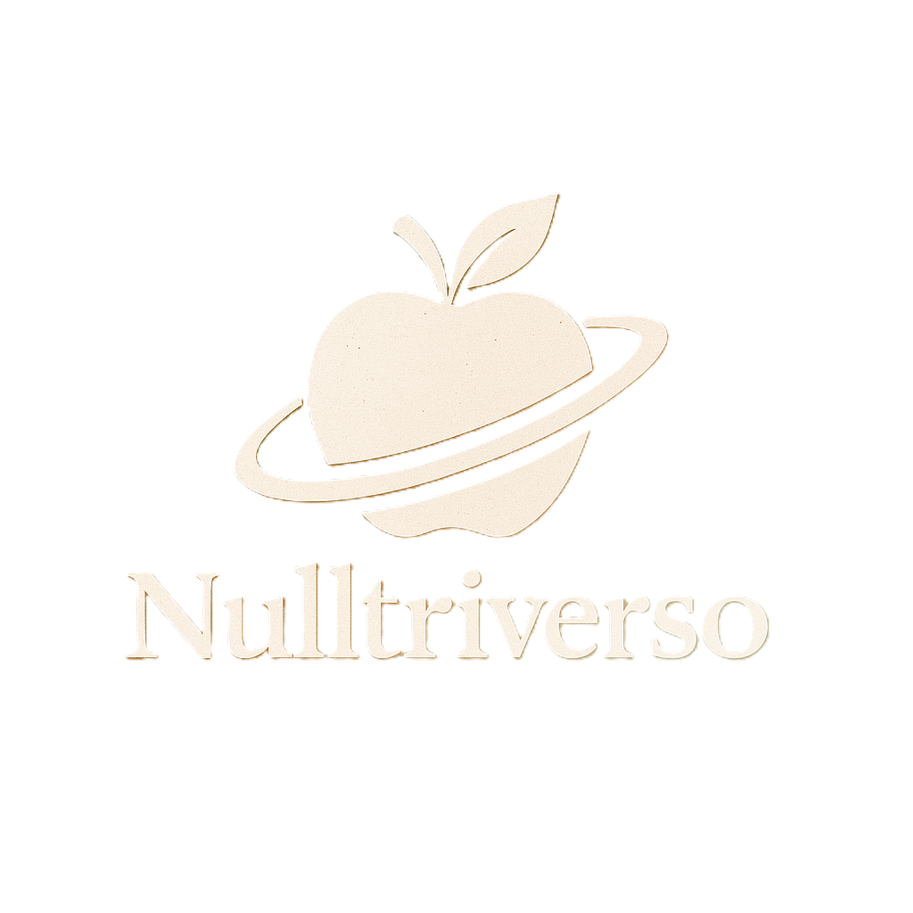

# Nulltriverso - Ecossistema de calculos nutricionais

<p align="center">
  
</p>

Aplicacao mobile em React Native + Expo com 12 calculadoras offline, identidade visual autoral (gradientes, campo de estrelas e logos proprios) e todas as formulas expostas na interface. Nenhum dado sai do dispositivo; o app existe para portfolio profissional de Helbert Miranda Benicio (Analista/Dev e Nutricionista CRN9 21602).

## O que ha no app

- Tela de boas-vindas/login animada com CTA "Seja bem-vindo!" que libera o menu (sem autenticacao real).
- Menu ilustrado em grade com 12 cards: IMC, RCEst/WHtR, RCQ, Peso acamado, TMB, EER, GET, NAF, % Gordura corporal, Massa muscular do braco (MAMA), Distribuicao de macros e Hidrica.
- Validacao imediata (ponto ou virgula aceitos), mensagens curtas e resultados coloridos com resumo em `ResultRow`.
- Gauge semicircular e linha mockada na tela de IMC; pills para protocolos e metodos em RCQ/RCEst/%GC/NAF/Hidrica.
- Persistencia local via AsyncStorage: ao reabrir a tela, o ultimo calculo volta preenchido.
- Barra inferior compartilhada para voltar ao menu, acionar perfil (stub) e sair (retorna ao login).

## Stack

- React Native 0.81 + Expo 54
- AsyncStorage para armazenamento local
- react-native-svg para gauge/linha do IMC
- expo-linear-gradient para fundos do login/menu
- Assets locais otimizados (logos e icones reduzidos para carregamento rapido)

## Como executar

```bash
cd Nulltriverso/frontend
npm install
npm start   # Expo DevTools (a = Android, i = iOS, w = Web)
```

Requisitos: Node.js 18+ e Expo Go em um dispositivo real ou emulador. Testes em aparelho real sao recomendados para validar teclados decimais e animacoes.

## Estrutura

- `Nulltriverso/frontend/App.js` controla o fluxo entre login, menu e calculadoras.
- `Nulltriverso/frontend/src/screens` reune telas de menu + 12 calculadoras (IMC, RCEst, RCQ, Peso acamado, TMB, EER, GET, NAF, %GC, MI, Macro, Hidrica).
- `Nulltriverso/frontend/src/components` traz cards, botoes, inputs, gauge/linha de IMC, barra inferior, campo de estrelas e seletores.
- `Nulltriverso/frontend/src/constants` guarda faixas, fatores, protocolos e chaves de storage.
- `Nulltriverso/frontend/src/utils` concentra funcoes puras para todos os calculos.
- `Docs/` possui a documentacao completa; `Apresentacao/` traz roteiro de demo.
- `Nulltriverso/backend` permanece reservado para futura integracao.

## Documentacao principal

- `Docs/01-Documentacao de Contexto.md`
- > <ol>
> <li><a href="Docs/01-Documentação de Contexto.md"> Documentação de Contexto</a></li>
> <li><a href="Docs/02-Especificação do Projeto.md"> Especificação do Projeto</a></li>
> <li><a href="Docs/03-Metodologia.md"> Metodologia</a></li>
> <li><a href="Docs/04-Projeto de Interface.md"> Projeto de Interface</a></li>
> <li><a href="Docs/05-Arquitetura da Solução.md"> Arquitetura da Solução</a></li>
> <li><a href="Docs/06-Template Padrão da Aplicação.md"> Template Padrão da Aplicação</a></li>
> <li><a href="Docs/07-Programação de Funcionalidades.md"> Programação de Funcionalidades</a></li>
> <li><a href="Docs/08-Plano de Testes de Software.md"> Plano de Testes de Software</a></li>
> <li><a href="Docs/09-Registro de Testes de Software.md"> Registro de Testes de Software</a></li>
> <li><a href="Docs/10-Plano de Testes de Usabilidade.md"> Plano de Testes de Usabilidade</a></li>
> <li><a href="Docs/11-Registro de Testes de Usabilidade.md"> Registro de Testes de Usabilidade</a></li>
> <li><a href="Docs/12-Apresentação do Projeto.md"> Apresentação do Projeto</a></li>
> <li><a href="Docs/13-Referências.md"> Referências</a></li>
</ol>
9 21602 e desenvolvedor. Projeto pessoal para portfolio.
